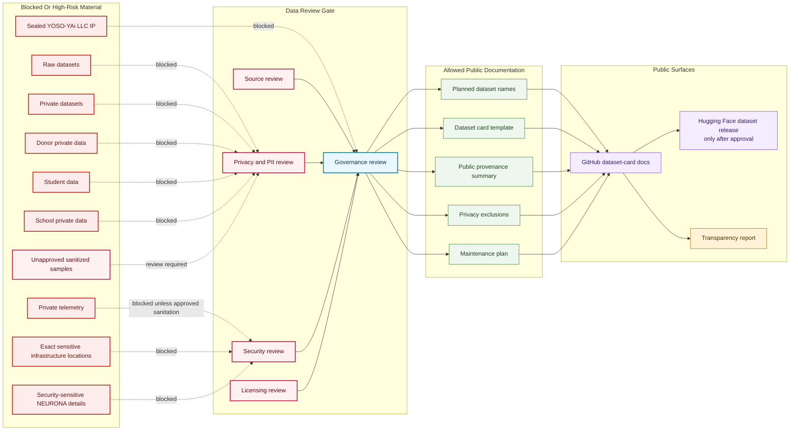

# Data Boundary Review Map

## Purpose

This graph separates public-safe dataset documentation from raw, private, sensitive, and sealed material that must not enter public dataset cards.

## Mermaid Diagram

## Interpretation Notes

- Public dataset-card docs can define standards, planned names, and release gates without publishing data.
- Unapproved sanitized samples are high-risk and require review before any public use.
- Hugging Face dataset release is downstream from approved GitHub documentation and governance review.

## Boundary Notes

- Raw datasets, donor data, student data, school private data, private telemetry, and exact sensitive locations are blocked from public docs.
- Public provenance summaries must not expose private source locations or sensitive operations.
- Dataset previews and generated examples inherit source boundaries until reviewed.

## Follow-Up Actions

- Add release approval records before first dataset release.
- Define dataset-specific exclusions in each reviewed dataset card.
- Revisit this map if any dataset moves to experimental status.
