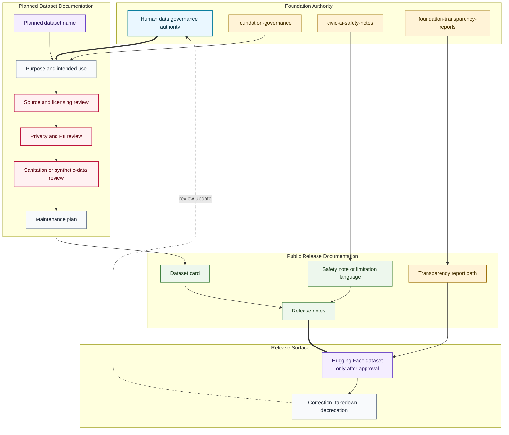

# Dataset Card Release Flow

## Purpose

This graph shows how a planned dataset moves through scope, source review, privacy review, dataset card documentation, maintenance planning, Hugging Face release, and monitoring.

## Mermaid Diagram

## Interpretation Notes

- Planned dataset names do not imply dataset artifacts exist.
- Dataset cards are release prerequisites, not post-release decoration.
- Hugging Face release is downstream from source, licensing, privacy, sanitation, safety, maintenance, and governance review.

## Boundary Notes

- Raw data, private data, unapproved sanitized samples, private telemetry, and sensitive infrastructure details stay outside public docs.
- Dataset cards must include privacy exclusions, PII statements, provenance, limitations, and maintenance paths.
- Monitoring can trigger correction, takedown, pause, or deprecation.

## Follow-Up Actions

- Add dataset-specific cards only after human review.
- Link Hugging Face dataset repositories only after they exist with approved cards.
- Update transparency reports after any release.
