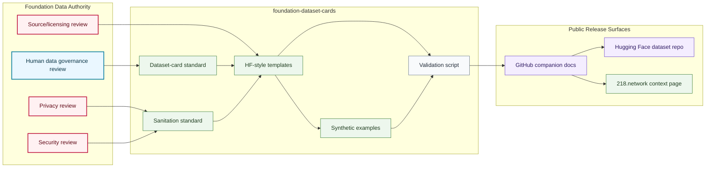

# Dataset Card System Map

## Purpose

This graph shows how dataset-card templates, sanitation standards, governance review, synthetic examples, validation, GitHub companions, and Hugging Face release surfaces relate.

## Mermaid Diagram

## Interpretation Notes

- Dataset-card templates are public documentation infrastructure, not data releases.
- Hugging Face is downstream from GitHub companion docs and human data review.
- Synthetic examples do not imply a dataset exists.

## Boundary Notes

- Dataset files, raw data, private data, unapproved sanitized samples, private telemetry, and sealed IP are excluded.
- Planned links stay placeholders until public artifacts exist.
- `218.network` context pages require separate public review.

## Follow-Up Actions

- Add dataset-specific cards only after data release review.
- Link public Hugging Face repositories only after they exist.
- Update this map when release gates change.
