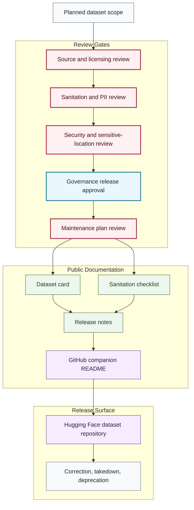

# Dataset Release Flow

## Purpose

This graph shows the release-documentation flow from planned dataset scope to reviewed public Hugging Face dataset release.

## Mermaid Diagram

## Interpretation Notes

- Planned dataset scope is not a release claim.
- Dataset cards and sanitation checklists are prerequisites for public release.
- Monitoring can trigger correction, takedown, pause, deprecation, or removal.

## Boundary Notes

- Raw data, private data, donor data, student data, volunteer data, customer data, private telemetry, and exact sensitive infrastructure locations do not enter public documentation.
- No dataset files are stored in this repository.
- Hugging Face links appear only after release approval.

## Follow-Up Actions

- Add release approval records outside this public repo when sensitive.
- Create dataset-specific companion docs only after review.
- Update status tables when a dataset changes state.
