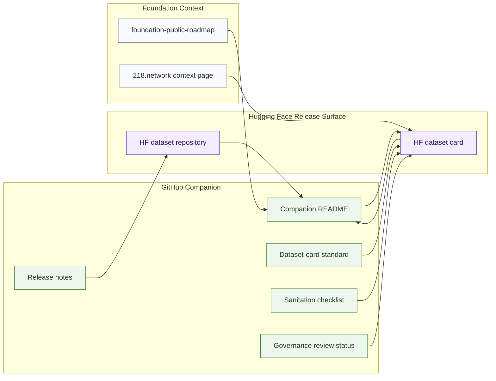

# GitHub To Hugging Face Map

## Purpose

This graph shows how GitHub companion documentation should connect to future reviewed Hugging Face dataset repositories.

## Mermaid Diagram

## Interpretation Notes

- GitHub stores companion docs and release notes.
- Hugging Face stores the reviewed public dataset artifact and card.
- Roadmap and `218.network` links provide status and context without replacing release review.

## Boundary Notes

- Placeholder links must not be treated as release evidence.
- Hugging Face must not be used for private data review artifacts.
- GitHub companion docs must not expose raw data, private data, telemetry, or sealed IP.

## Follow-Up Actions

- Add actual Hugging Face links only after public repositories exist.
- Update companion README templates as release requirements mature.
- Keep roadmap status aligned with link status.
