# Public Private Boundary Map

## Purpose

This graph separates public dataset-card material from private, sealed, and blocked data material.

## Mermaid Diagram

```mermaid
flowchart LR
  subgraph public["Allowed Public Documentation"]
    templates["Dataset-card templates"]:::public
    synthetic["Synthetic examples"]:::public
    status["Status language"]:::public
    provenance["Reviewed provenance summaries"]:::public
    notes["Release and maintenance notes"]:::public
  end

  subgraph blocked["Blocked Material"]
    files["Dataset files"]:::sealed
    raw["Raw datasets"]:::sealed
    privateData["Private datasets"]:::sealed
    samples["Unapproved sanitized samples"]:::sealed
    pii["Donor, student, volunteer, customer data"]:::sealed
    telemetry["Private telemetry"]:::sealed
    locations["Exact sensitive locations"]:::sealed
    sealedIp["Sealed YOSO-YAi LLC IP"]:::sealed
  end

  subgraph gate["Data Release Gate"]
    privacy["Privacy review"]:::risk
    security["Security review"]:::risk
    governance["Human approval"]:::authority
  end

  public --> privacy
  blocked -. excluded or review required .-> privacy
  privacy --> security
  security --> governance

  classDef authority fill:#eaf7ff,stroke:#027a9d,stroke-width:2px,color:#083344;
  classDef public fill:#edf7ed,stroke:#3a7d3a,color:#1f3d1f;
  classDef sealed fill:#fdecec,stroke:#b42318,stroke-width:2px,color:#5f1711;
  classDef risk fill:#fff1f2,stroke:#be123c,stroke-width:2px,color:#5f0715;
```

## Interpretation Notes

- Public templates can describe required fields without publishing data.
- Blocked material may not be published as examples, screenshots, logs, summaries, generated outputs, or samples without review.
- Human data approval remains required before release.

## Boundary Notes

- No dataset files, raw data, private records, unapproved samples, private telemetry, sensitive locations, or sealed IP are stored here.
- Planned dataset names remain non-release references.
- Hugging Face release remains downstream from review.

## Follow-Up Actions

- Keep dataset-specific exclusions in every reviewed card.
- Expand blocked categories if new sensitive artifact types appear.
- Align Hugging Face releases to this boundary.
