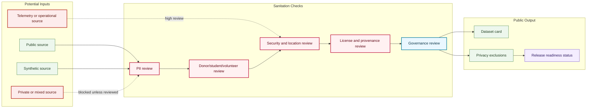

# Sanitation Review Flow

## Purpose

This graph shows how source material moves through sanitation review before a public dataset card or dataset release can be approved.

## Mermaid Diagram

## Interpretation Notes

- Public and synthetic sources still require review before release.
- Private or mixed sources remain blocked unless a public-safe release path is approved.
- Privacy exclusions are public documentation, not proof that a dataset exists.

## Boundary Notes

- Do not publish raw records, private records, telemetry, sensitive locations, or samples from private sources in this repo.
- Unapproved sanitized samples are blocked.
- NEURONA operational details require security review and are excluded by default.

## Follow-Up Actions

- Keep sanitation checklist templates aligned to this flow.
- Add dataset-specific sanitation summaries only after review.
- Revisit high-review telemetry rules before any telemetry sample release.
